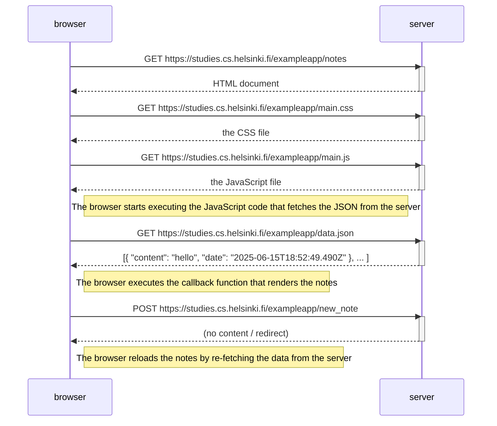

# Exercise 0.4: new note
Make a diagram that describes what happens when a user creates a new note while on the page <https://studies.cs.helsinki.fi/exampleapp/notes> , i.e. writes something in the text field and presses the save button .

If necessary, write the operations taking place on the server or in the browser as appropriate comments in the diagram.

## Solution

