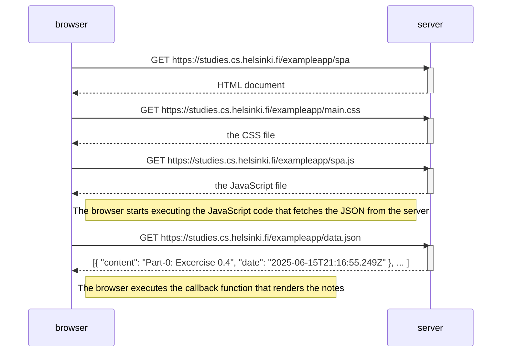

# Excercise 0.5: Single Page App
Make a diagram of a situation where a user goes to <https://studies.cs.helsinki.fi/exampleapp/spa> , the Single Page App version of Notes, using a browser.

# Solution
