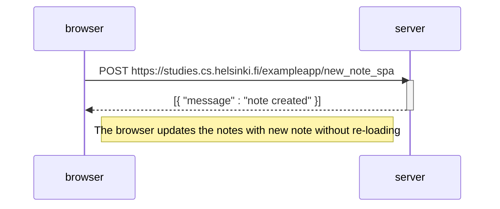

# Excercise 0.6: New note
Make a diagram of a situation where a user creates a new note in the single page version.

# Solution

```mermaid
sequenceDiagram
    participant browser
    participant server

    browser->>server: POST https://studies.cs.helsinki.fi/exampleapp/new_note_spa
    activate server
    server-->>browser: [{ "message" : "note created" }]
    deactivate server

    Note right of browser: The browser updates the notes with new note without re-loading

```